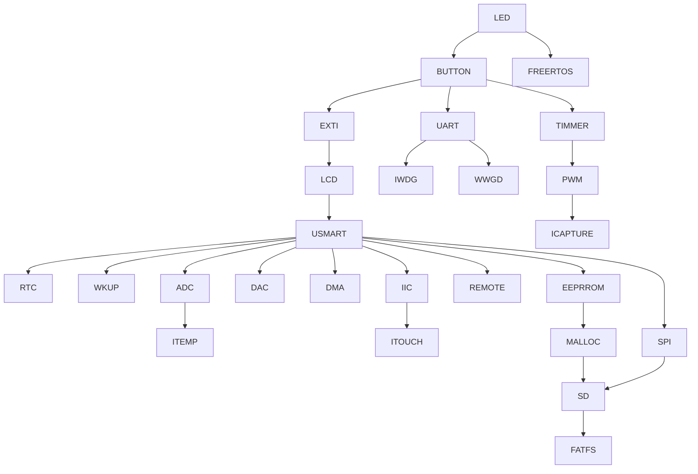

# 基于正点原子 MiniSTM 的使用 STM32CubeMX 初始化的 HAL 库例程

项目基于正点原子 MiniSTM 开发板的硬件使用 STM32CubeMX + Keil 开发。由于正点原子的 HAL 库例程是其多次封装后开发的，不方便之后的移植。所以重新由 STM32CubeMX 搭建初始化的框架，再在此基础上重写正点原子的 HAL 库例程。

## 例程目录

## 例程文件结构

	├─Core: 核心文件夹
	│  ├─Inc: 头文件文件夹
	│  └─Src: 源文件文件夹
	├─Drivers: 
	│  ├─CMSIS: 微控制器软件接口标准文件夹
	│  └─STM32F1xx_HAL_Driver: HAL 驱动文件夹
	├─MDK-ARM: 驱动文件夹
	│	├─DebugConfig: Debug设置文件夹
	│	├─MiniSTM: 编译后的烧录文件文件夹
	│	├─RTE: 运行时环境组件配置文件文件夹
	│	└─MiniSTM.uvprojx: Keil 工程文件
	├─keilkilll.bat: 删除编译过程文件
	└─MiniSTM.ioc: STM32CubeMX 工程文件
